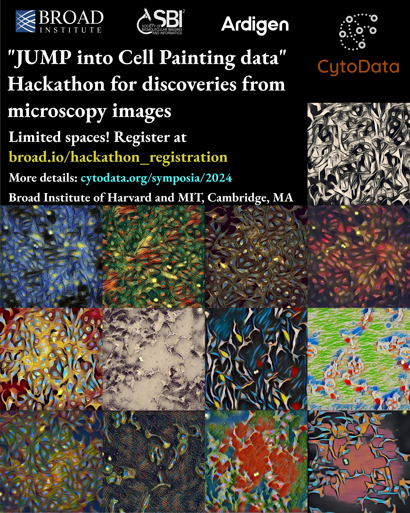

# CytoData in 2024

We are thrilled to announce that this year, CytoData is joining forces with [SBI2](<https://sbi2.org/>)! You can take part in the traditional CytoData Hackathon on September 17 (see [details below](#cytodata-2024-hackathon-at-the-broad-institute)), and join us from September 18-20 for an event supercharged in spatial and morphological profiling. The CytoData board is organizing a colloquium on "Image-based profiling of biological systems across scales and modalities" on September 18 and the SBI2 society prepared an exciting line-up of workshops and speakers tailored to the bioimaging and analysis community. [Registrations and abstract submissions are open.](https://sbi2.org/conference/#registration)

# CytoData 2024 Hackathon at the Broad Institute

1.  [Quick overview](#quick-overview)
2.  [Registration link](#registration-link)
3.  [Agenda](#agenda)
4.  [Prizes](#prizes)
5.  [FAQ](#faq)
    1.  [What is JUMP?](#what-is-jump)
    2.  [Can I access the data beforehand?](#can-i-access-the-data-beforehand)
	3.  [How much compute will I need?](#compute)
	4.  [Are there available tools/libraries to work with JUMP?](#tools)
    5.  [Are teams assembled there or can I organize my own team?](#are-teams-assembled-there-or-can-i-organize-my-own-team)
    6.  [Do you offer fee waivers?](#do-you-offer-fee-waivers)
    7.  [Can I get in touch with other participants and form a team beforehand?](#can-i-get-in-touch-with-other-participants-and-form-a-team-beforehand)
    8.  [More questions?](#more-questions)
6.  [Resources for participants](#resources-for-participants)
    1.  [How to get to the Broad Institute?](#how-to-get-to-the-broad-institute)
    2.  [Are there places to eat around?](#are-there-places-to-eat-around)
    3.  [Whereabouts in the building will the event take place?](#whereabouts-in-the-building-will-the-event-take-place)

## Quick overview

The main goal of this event is to bring together biologists and computer scientists to use [Morphological Profiling](https://www.broadinstitute.org/imaging/morphological-profiling) data to gain novel biological insights. You can bring your own question to the event or get together with experts and come up with one there. The idea is for everyone to have fun, learn how to use morphological data to ask/answer biological questions and meet other scientists with similar interests.

We strongly encourage biologists to apply, regardless of their expertise in computational methods or their familiarity with the field of morphological profiling.

This event is part of the [SBI2](https://sbi2.org/conference/)+[Cytodata](https://www.cytodata.org/symposia/2024/) events.

## Registration link

If you want tho register [follow this link](https://broad.io/hackathon_registration). The cost of registration is 20 USD, which aims to cover catering needs.  
Due to space constraints, the number of tickets is limited.

## Agenda

The Hackathon will occur on September 17th, 2024 at The Broad Institute&rsquo;s Merkin Building: 415 Main St, Cambridge, MA 02142.


<table border="2" cellspacing="0" cellpadding="6" rules="groups" frame="hsides">

<colgroup>
<col  class="org-right" />

<col  class="org-left" />
</colgroup>
<thead>
<tr>
<th scope="col" class="org-right">Time</th>
<th scope="col" class="org-left">Agenda</th>
</tr>
</thead>

<tbody>
<tr>
<td class="org-right">08:30-09:00</td>
<td class="org-left">Registration and light breakfast</td>
</tr>

<tr>
<td class="org-right">09:00-10:00</td>
<td class="org-left">Introduction</td>
</tr>

<tr>
<td class="org-right">10:00-12:00</td>
<td class="org-left">First session</td>
</tr>

<tr>
<td class="org-right">12:00-13:00</td>
<td class="org-left">Lunch</td>
</tr>

<tr>
<td class="org-right">13:00-15:40</td>
<td class="org-left">Second session</td>
</tr>

<tr>
<td class="org-right">15:40-16:00</td>
<td class="org-left">Coffee break</td>
</tr>

<tr>
<td class="org-right">16:00-17:30</td>
<td class="org-left">Third session</td>
</tr>

<tr>
<td class="org-right">17:30-18:00</td>
<td class="org-left">Wrap up (5 min) presentations and awards</td>
</tr>
</tbody>
</table>


## Prizes

We will offer two different tracks:

-   Best new biological story, or, how can we use JUMP to gain novel biological insight?
-   Best new tool/method, or, how to make JUMP data more accessible/develop a novel processing technique?

For each track there will be a 500 USD prize in giftcards for the winning team.

## FAQ

### What is JUMP?

JUMP stands for Joint Undertaking in Morphological Profiling. You can read more about the project [here](https://jump-cellpainting.broadinstitute.org/).

### Can I access the data beforehand?

The data is available right now, and you can see different ways to explore it [here](https://broad.io/jump).

### How much compute will I need?

The JUMP datasets have already been pre-processed, so the compute needs are low. Most of the data fits in a laptop. If you have more ambitious goals you may use servers of your own, but for this particular event we want to steer participants towards creative and innovative solution to their problems over high-throughput analyses.

### Are there available tools/libraries to work with JUMP?

Yes! You can look at the current tech stack of the Broad Institute's Carpenter-Singh Lab over at their [monorepo](https://broad.io/monorepo). Many of those tools are under constant development, so feel free to open issues/PRs if you find them useful and want to contribute.

### Are teams assembled there or can I organize my own team?

Both options are valid! The registration form contains a section to indicate whether you come with a team or not.

### Do you offer fee waivers?

We are unable to do so this time, but keep tabs on future online events and workshops.

### Can I get in touch with other participants and form a team beforehand?

Yes! The registration form allows you to give consent to share your name, email and interests with the other participants before the event.

### More questions?

Feel free to send an email to [amunozgo@broadinstitute.org](mailto:amunozgo@broadinstitute.org).

## Resources for participants

This section will be updated to concentrate details relevant to participants during the Hackathon.

### How to get to the Broad Institute?

See the official [getting here](https://www.broadinstitute.org/getting-here) webpage.

### Are there places to eat around?

We will provide lunch and a light breakfast, but there are plenty of cafes and restaurants in the area.

### Whereabouts in the building will the event take place?

The start and lunch events will occur on the sixth floor section that connects 415 Main St. and 75 Ames (the room is called Serengeti).
For the hacking sessions people will be split between Serengeti and other locations in the M1 floor (Mezzanine)
There will be Broadies from the Imaging Platform who will show you the two floors and bring you to your floors and give you further indications.
