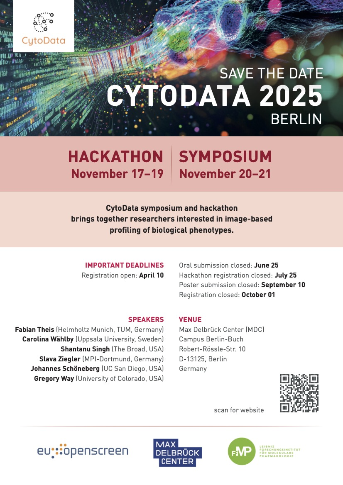

# CytoData 2025

We are thrilled to announce that EU-OPENSCREEN, MDC, and FMP will host CytoData 2025 at the Campus Berlin-Buch, Berlin, Germany! 
The CytoData symposium will take place on **November 20-21, 2025**, and will be preceded by a Hackathon from **November 17-19, 2025**.

Confirmed speakers: [Fabian Theis](https://www.helmholtz-munich.de/en/icb/pi/fabian-theis) (Helmholtz Munich, Germany), [Carolina Wählby](https://www.uu.se/en/contact-and-organisation/staff?query=N96-5999) (Uppsala University, Sweden), [Shantanu Singh](https://www.broadinstitute.org/bios/shantanu-singh) (Broad Institute, USA), [Slava Ziegler](https://www.mpi-dortmund.mpg.de/research/departments/chemical-biology/ziegler) (MPI-Dortmund, Germany), [Johannes Schoeneberg](https://pharmacology.ucsd.edu/faculty/department-faculty/johannes-schoneberg.html) (UC San Diego, USA), and [Gregory Way](https://som.cuanschutz.edu/Profiles/Faculty/Profile/36217) (University of Colorado, USA). 

## Questions?

For inquiries, you can contact the organizers on the [Image.sc forum](https://forum.image.sc/t/save-the-date-cytodata-2025/106014/1).

# CytoData 2025 Hackathon

The focus of the Hackathon will be the analysis of Cell Painting data generated by an EU-OPENSCREEN-led initiative. We are looking forward to an exciting scientific program and welcome everyone interested in image-based profiling to join us in Berlin! More information will be available soon. 